<!-- README.md is generated from README.Rmd. Please edit the README.Rmd file -->

# Lab report \#1

Step 1 Result:

``` r
library(classdata)
library(tidyverse)
```

    ## ── Attaching core tidyverse packages ──────────────────────── tidyverse 2.0.0 ──
    ## ✔ dplyr     1.1.3     ✔ readr     2.1.4
    ## ✔ forcats   1.0.0     ✔ stringr   1.5.0
    ## ✔ ggplot2   3.4.3     ✔ tibble    3.2.1
    ## ✔ lubridate 1.9.2     ✔ tidyr     1.3.0
    ## ✔ purrr     1.0.2     
    ## ── Conflicts ────────────────────────────────────────── tidyverse_conflicts() ──
    ## ✖ dplyr::filter() masks stats::filter()
    ## ✖ dplyr::lag()    masks stats::lag()
    ## ℹ Use the conflicted package (<http://conflicted.r-lib.org/>) to force all conflicts to become errors

``` r
ames = ames
```

``` r
head(ames)
```

    ## # A tibble: 6 × 16
    ##   `Parcel ID` Address      Style Occupancy `Sale Date` `Sale Price` `Multi Sale`
    ##   <chr>       <chr>        <fct> <fct>     <date>             <dbl> <chr>       
    ## 1 0903202160  1024 RIDGEW… 1 1/… Single-F… 2022-08-12        181900 <NA>        
    ## 2 0907428215  4503 TWAIN … 1 St… Condomin… 2022-08-04        127100 <NA>        
    ## 3 0909428070  2030 MCCART… 1 St… Single-F… 2022-08-15             0 <NA>        
    ## 4 0923203160  3404 EMERAL… 1 St… Townhouse 2022-08-09        245000 <NA>        
    ## 5 0520440010  4507 EVERES… <NA>  <NA>      2022-08-03        449664 <NA>        
    ## 6 0907275030  4512 HEMING… 2 St… Single-F… 2022-08-16        368000 <NA>        
    ## # ℹ 9 more variables: YearBuilt <dbl>, Acres <dbl>,
    ## #   `TotalLivingArea (sf)` <dbl>, Bedrooms <dbl>,
    ## #   `FinishedBsmtArea (sf)` <dbl>, `LotArea(sf)` <dbl>, AC <chr>,
    ## #   FirePlace <chr>, Neighborhood <fct>

``` r
names(ames)
```

    ##  [1] "Parcel ID"             "Address"               "Style"                
    ##  [4] "Occupancy"             "Sale Date"             "Sale Price"           
    ##  [7] "Multi Sale"            "YearBuilt"             "Acres"                
    ## [10] "TotalLivingArea (sf)"  "Bedrooms"              "FinishedBsmtArea (sf)"
    ## [13] "LotArea(sf)"           "AC"                    "FirePlace"            
    ## [16] "Neighborhood"

``` r
glimpse(ames)
```

    ## Rows: 6,935
    ## Columns: 16
    ## $ `Parcel ID`             <chr> "0903202160", "0907428215", "0909428070", "092…
    ## $ Address                 <chr> "1024 RIDGEWOOD AVE, AMES", "4503 TWAIN CIR UN…
    ## $ Style                   <fct> 1 1/2 Story Frame, 1 Story Frame, 1 Story Fram…
    ## $ Occupancy               <fct> Single-Family / Owner Occupied, Condominium, S…
    ## $ `Sale Date`             <date> 2022-08-12, 2022-08-04, 2022-08-15, 2022-08-0…
    ## $ `Sale Price`            <dbl> 181900, 127100, 0, 245000, 449664, 368000, 0, …
    ## $ `Multi Sale`            <chr> NA, NA, NA, NA, NA, NA, NA, NA, NA, NA, NA, NA…
    ## $ YearBuilt               <dbl> 1940, 2006, 1951, 1997, NA, 1996, 1960, 2006, …
    ## $ Acres                   <dbl> 0.109, 0.027, 0.321, 0.103, 0.287, 0.494, 0.17…
    ## $ `TotalLivingArea (sf)`  <dbl> 1030, 771, 1456, 1289, NA, 2223, 1165, 658, 13…
    ## $ Bedrooms                <dbl> 2, 1, 3, 4, NA, 4, 5, 1, 3, 4, 4, 2, 2, 3, 2, …
    ## $ `FinishedBsmtArea (sf)` <dbl> NA, NA, 1261, 890, NA, NA, 906, NA, NA, 500, 5…
    ## $ `LotArea(sf)`           <dbl> 4740, 1181, 14000, 4500, 12493, 21533, 7500, 1…
    ## $ AC                      <chr> "Yes", "Yes", "Yes", "Yes", "No", "Yes", "Yes"…
    ## $ FirePlace               <chr> "Yes", "No", "No", "No", "No", "Yes", "Yes", "…
    ## $ Neighborhood            <fct> (28) Res: Brookside, (55) Res: Dakota Ridge, (…

``` r
glimpse(ames)
```

    ## Rows: 6,935
    ## Columns: 16
    ## $ `Parcel ID`             <chr> "0903202160", "0907428215", "0909428070", "092…
    ## $ Address                 <chr> "1024 RIDGEWOOD AVE, AMES", "4503 TWAIN CIR UN…
    ## $ Style                   <fct> 1 1/2 Story Frame, 1 Story Frame, 1 Story Fram…
    ## $ Occupancy               <fct> Single-Family / Owner Occupied, Condominium, S…
    ## $ `Sale Date`             <date> 2022-08-12, 2022-08-04, 2022-08-15, 2022-08-0…
    ## $ `Sale Price`            <dbl> 181900, 127100, 0, 245000, 449664, 368000, 0, …
    ## $ `Multi Sale`            <chr> NA, NA, NA, NA, NA, NA, NA, NA, NA, NA, NA, NA…
    ## $ YearBuilt               <dbl> 1940, 2006, 1951, 1997, NA, 1996, 1960, 2006, …
    ## $ Acres                   <dbl> 0.109, 0.027, 0.321, 0.103, 0.287, 0.494, 0.17…
    ## $ `TotalLivingArea (sf)`  <dbl> 1030, 771, 1456, 1289, NA, 2223, 1165, 658, 13…
    ## $ Bedrooms                <dbl> 2, 1, 3, 4, NA, 4, 5, 1, 3, 4, 4, 2, 2, 3, 2, …
    ## $ `FinishedBsmtArea (sf)` <dbl> NA, NA, 1261, 890, NA, NA, 906, NA, NA, 500, 5…
    ## $ `LotArea(sf)`           <dbl> 4740, 1181, 14000, 4500, 12493, 21533, 7500, 1…
    ## $ AC                      <chr> "Yes", "Yes", "Yes", "Yes", "No", "Yes", "Yes"…
    ## $ FirePlace               <chr> "Yes", "No", "No", "No", "No", "Yes", "Yes", "…
    ## $ Neighborhood            <fct> (28) Res: Brookside, (55) Res: Dakota Ridge, (…

``` r
str(ames)
```

    ## tibble [6,935 × 16] (S3: tbl_df/tbl/data.frame)
    ##  $ Parcel ID            : chr [1:6935] "0903202160" "0907428215" "0909428070" "0923203160" ...
    ##  $ Address              : chr [1:6935] "1024 RIDGEWOOD AVE, AMES" "4503 TWAIN CIR UNIT 105, AMES" "2030 MCCARTHY RD, AMES" "3404 EMERALD DR, AMES" ...
    ##  $ Style                : Factor w/ 12 levels "1 1/2 Story Brick",..: 2 5 5 5 NA 9 5 5 5 5 ...
    ##  $ Occupancy            : Factor w/ 5 levels "Condominium",..: 2 1 2 3 NA 2 2 1 2 2 ...
    ##  $ Sale Date            : Date[1:6935], format: "2022-08-12" "2022-08-04" ...
    ##  $ Sale Price           : num [1:6935] 181900 127100 0 245000 449664 ...
    ##  $ Multi Sale           : chr [1:6935] NA NA NA NA ...
    ##  $ YearBuilt            : num [1:6935] 1940 2006 1951 1997 NA ...
    ##  $ Acres                : num [1:6935] 0.109 0.027 0.321 0.103 0.287 0.494 0.172 0.023 0.285 0.172 ...
    ##  $ TotalLivingArea (sf) : num [1:6935] 1030 771 1456 1289 NA ...
    ##  $ Bedrooms             : num [1:6935] 2 1 3 4 NA 4 5 1 3 4 ...
    ##  $ FinishedBsmtArea (sf): num [1:6935] NA NA 1261 890 NA ...
    ##  $ LotArea(sf)          : num [1:6935] 4740 1181 14000 4500 12493 ...
    ##  $ AC                   : chr [1:6935] "Yes" "Yes" "Yes" "Yes" ...
    ##  $ FirePlace            : chr [1:6935] "Yes" "No" "No" "No" ...
    ##  $ Neighborhood         : Factor w/ 42 levels "(0) None","(13) Apts: Campus",..: 15 40 19 18 6 24 14 40 13 23 ...

As a team, we inspected the ames dataset using glimpse(), names(), and
str(). We found that the dataset contains 16 variables: Parcel ID,
Address, Style, Occupancy, Sale Date, Sale Price, Multi Sale, YearBuilt,
Acres, TotalLivingArea (sf), Bedrooms, FinishedBsmtArea (sf),
LotArea(sf), AC, FirePlace, and Neighborhood. These variables include
character variables such as identifiers and labels, factor variables
such as housing style and neighborhood, one date variable (Sale Date),
and several numeric variables such as Sale Price, YearBuilt, lot size,
and living area. Based on the variable names and sample values, the
dataset records property sale information, structural features, lot
size, and location details for residential properties in Ames. We would
expect identifiers and addresses to mostly appear as text, categorical
variables to come from a limited set of repeated categories, sale dates
to be valid dates, and numeric variables such as sale price, acreage,
living area, and lot area to be nonnegative values. We also noticed that
some variables contain missing values (NA), which may need to be
considered during later analysis.

Step 2 Result:

``` r
head(ames$`Sale Price`)
```

    ## [1] 181900 127100      0 245000 449664 368000

Sale Price is the main variable in the dataset. It’s the main variable
we want to predict with given unseen data. Most other variables in the
dataset will be directly correlated with the sale price of the property.

Step 3 Result:

``` r
price <-ames$`Sale Price`
range(ames[["Sale Price"]], na.rm = FALSE)
```

    ## [1]        0 20500000

``` r
mean(ames$`Sale Price`)
```

    ## [1] 1017479

``` r
median(ames$`Sale Price`)
```

    ## [1] 170900

``` r
library(ggplot2)
#Graph with outliers
ggplot(ames, aes(x = price)) +
  geom_histogram(binwidth = 1000000, color = "blue", fill = "white") +
  labs(title = "Sales Price",
       x = "Price ($)",
       y = "Frequency")
```

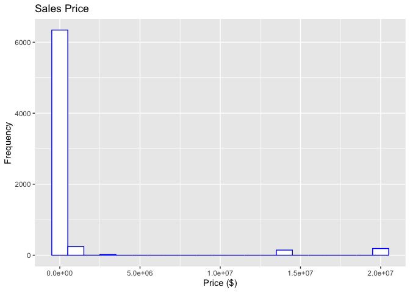<!-- -->

``` r
#Graph without outliers
Q1 <- quantile(ames$`Sale Price`, 0.25, na.rm = TRUE)
Q3 <- quantile(ames$`Sale Price`, 0.75, na.rm = TRUE)
IQR_value <- IQR(ames$`Sale Price`, na.rm = TRUE)

lower_bound <- Q1 - 1.5 * IQR_value
upper_bound <- Q3 + 1.5 * IQR_value

ames_no_outliers <- ames[
  ames$`Sale Price` >= lower_bound &
  ames$`Sale Price` <= upper_bound,
]

ggplot(ames_no_outliers, aes(x = `Sale Price`)) +
  geom_histogram(binwidth = 100000, color = "blue", fill = "white") +
  labs(title = "Sales Price",
       x = "Price ($)",
       y = "Frequency")
```

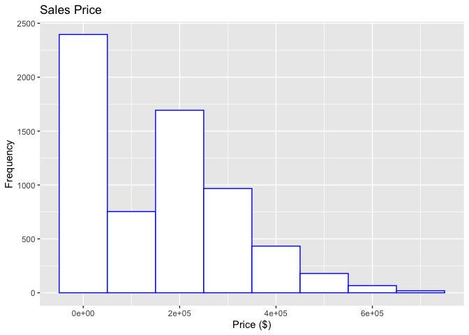<!-- --> The general
pattern of the sale price graph is it is skewed to the right. That means
majority of the houses sold are going to be in the cheaper range. There
are also a few severe outliers. The range of this dataset consists of
the most expensive sale being 20.5 million and the lowest sale being 0.
The average is is 1,017,479. The median being 170,900.

Step 4 Result: Nicolas Result: acres

Nicole Result:

``` r
unique(ames$Bedrooms)
```

    ##  [1]  2  1  3  4 NA  5  6  0  8  7 10

``` r
nicolePlot1 <- ggplot(aes(x= Bedrooms), data = ames) +
  geom_bar(na.rm = T) +
  geom_text(stat = 'count', aes(label = after_stat(count), vjust = -.5)) +
  labs(
    title = 'Number of Bedrooms',
    x = "Number of Bedrooms")
nicolePlot1
```

    ## Warning: Removed 447 rows containing non-finite values (`stat_count()`).

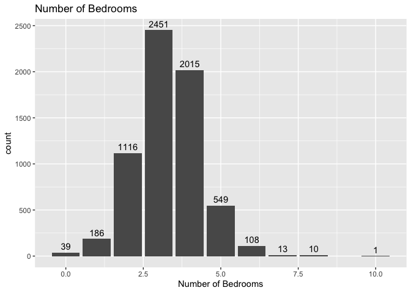<!-- -->

The distribution of the number of bedrooms is approximately bell shaped
with the mode being 3 bedrooms. There are 39 houses with 0 bedrooms. The
maximum number of bedrooms is 10.

``` r
filteredAmes <- ames[ames$`Sale Price`<= 1000000 & !is.na(ames$Bedrooms) & ames$`Sale Price`!= 0, ]

nicolePlot2 <- ggplot(filteredAmes, aes(x = factor(Bedrooms), y = `Sale Price`)) +
  geom_boxplot(na.rm = TRUE) +
  coord_cartesian(ylim = c(0, 600000)) +
  labs(
    x = 'Number of Bedrooms',
    y = 'Sale Price (USD)',
    title = 'Sale Price Boxplots: Number of Bedrooms'
  )
nicolePlot2
```

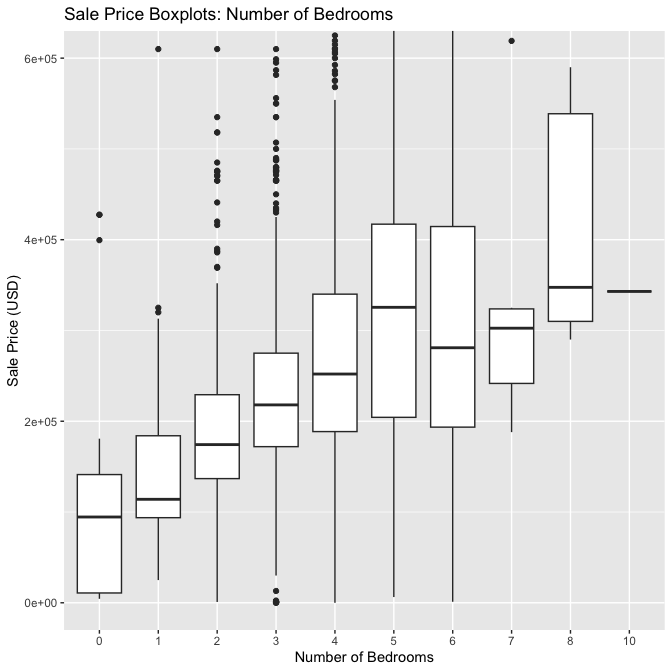<!-- --> This diagram
shows that the median sale prices of Ames houses generally increase with
the number of bedrooms. However, houses with 6 or 7 bedrooms had a lower
median sale price than houses with 5 or 8 bedrooms. 8 bedroom houses had
the highest median sale price and the largest IQR of sale prices. Houses
with 1, 2, 3, or 7 bedrooms all showed fairly small IQRs. There are
several outliers on the high end (sale price \>= \$1,000,000) that are
not displayed in this chart for visualization purposes.

``` r
amesOutliers <- ames[ames$`Sale Price` >= 1000000, ]
nicolePlot3 <- ggplot(amesOutliers, aes(x = Bedrooms, y = `Sale Price`)) +
  geom_point() +
  labs(
    title = 'Ames Housing Sale Prices (>= $1,000,000) vs Number of Bedrooms',
    xlab = 'Number of Bedrooms',
    ylab = 'Sale Price (USD)',
  )
nicolePlot3
```

    ## Warning: Removed 24 rows containing missing values (`geom_point()`).

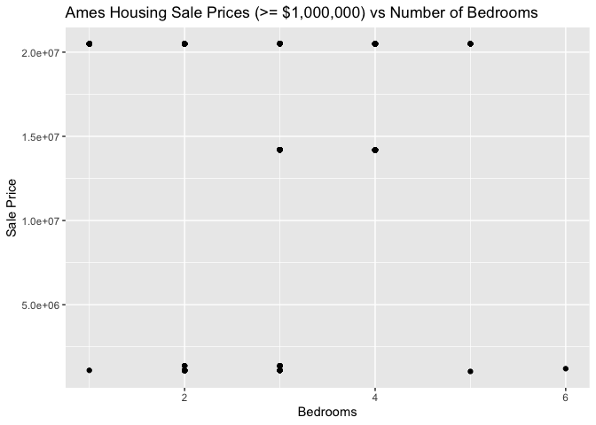<!-- -->

There does not appear to be a relationship between the number of
bedrooms and the sale price of houses that sold for over \$1,000,000.

Scott Result: Finished Basement Area

``` r
summary(ames$`FinishedBsmtArea (sf)`)
```

    ##    Min. 1st Qu.  Median    Mean 3rd Qu.    Max.    NA's 
    ##    10.0   474.0   727.0   776.7  1011.0  6496.0    2682

``` r
hist(ames$`FinishedBsmtArea (sf)`,
     main = "Histogram of Finished Basement Area",
     xlab = "Finished Basement Area (sq ft)",
     col = "lightblue",
     border = "black")
```

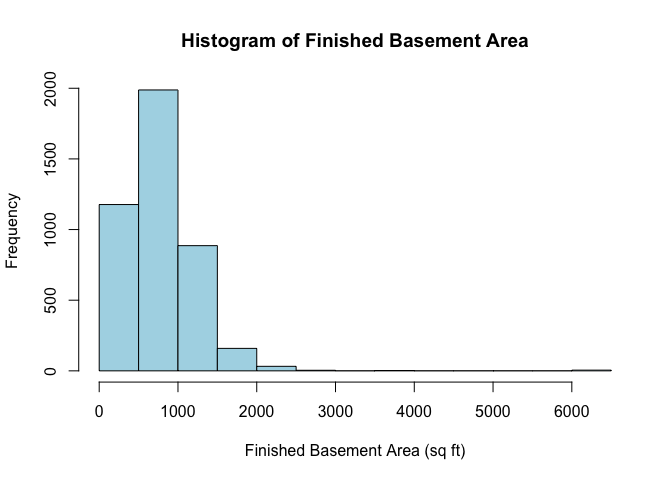<!-- -->

``` r
boxplot(ames$`FinishedBsmtArea (sf)`,
        main = "Boxplot of Finished Basement Area",
        horizontal = TRUE,
        col = "lightgreen")
```

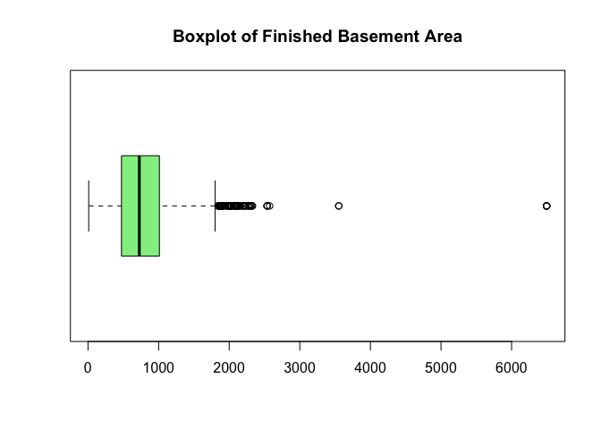<!-- -->

``` r
plot(ames$`FinishedBsmtArea (sf)`,
     ames$`Sale Price`,
     main = "Finished Basement Area vs Sale Price",
     xlab = "Finished Basement Area (sq ft)",
     ylab = "Sale Price",
     pch = 19,
     col = "steelblue")
```

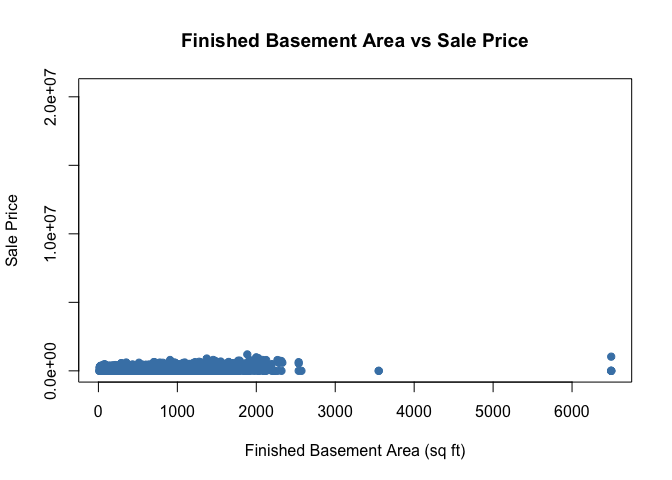<!-- --> The variable
Finished Basement Area (sf) measures the square footage of finished
basement space in each home. The histogram shows that the distribution
is right-skewed, with many homes having smaller finished basement areas
and fewer homes having very large finished basements. The boxplot
indicates the presence of some high-value outliers. The scatterplot
comparing finished basement area and sale price suggests a positive
relationship: homes with larger finished basement areas tend to have
higher sale prices. However, the relationship does not appear perfectly
linear, and other factors likely also influence sale price.

``` r
cor(ames$`FinishedBsmtArea (sf)`,
    ames$`Sale Price`,
    use = "complete.obs")
```

    ## [1] 0.1780473

This value shows that there is not a strong correlation between having a
finished basement and the sale price increasing.

``` r
ames$BasementFinished <- ifelse(
  ames$`FinishedBsmtArea (sf)` > 0,
  "Finished",
  "Not Finished"
)
```

``` r
library(ggplot2)

ggplot(ames, aes(x = BasementFinished)) +
  geom_bar(fill = "steelblue") +
  labs(title = "Finished vs Not Finished Basements",
       x = "Basement Status",
       y = "Number of Homes") +
  theme_minimal()
```

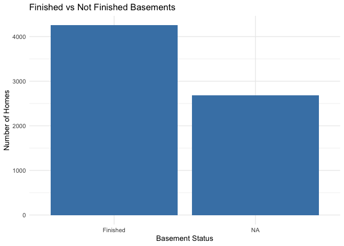<!-- --> The bar
chart shows the number of homes with finished versus unfinished
basements. Most homes in the dataset have a finished basement, while a
smaller portion have no finished basement area. This suggests that
finished basements are common among properties in Ames and may
contribute to differences in sale price.

Shashank Result: YearBuilt

Range of the Variable / Description of the Pattern

``` r
summary(ames$YearBuilt)
```

    ##    Min. 1st Qu.  Median    Mean 3rd Qu.    Max.    NA's 
    ##       0    1956    1978    1976    2002    2022     447

``` r
range(ames$YearBuilt, na.rm = TRUE)
```

    ## [1]    0 2022

YearBuilt (solo) Plot

``` r
ggplot(ames, aes(x = YearBuilt)) +
  geom_histogram(bins = 30) +
  labs(
    title = "Distribution of Year Built",
    x = "Year Built",
    y = "Count"
  )
```

    ## Warning: Removed 447 rows containing non-finite values (`stat_bin()`).

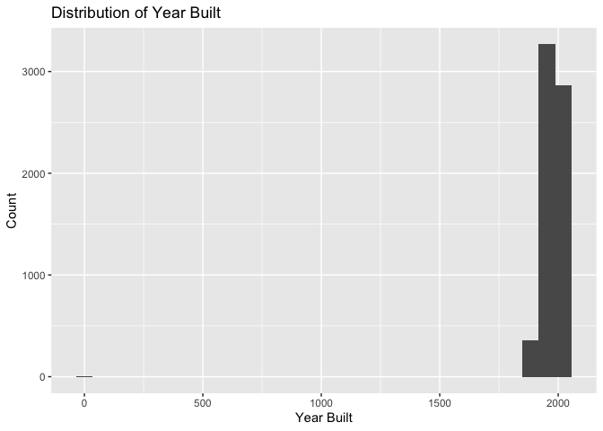<!-- -->

YearBuilt vs. Sale Price

``` r
ggplot(ames, aes(x = YearBuilt, y = `Sale Price`)) +
  geom_point(alpha = 0.5) +
  labs(
    title = "Sale Price vs Year Built",
    x = "Year Built",
    y = "Sale Price"
  )
```

    ## Warning: Removed 447 rows containing missing values (`geom_point()`).

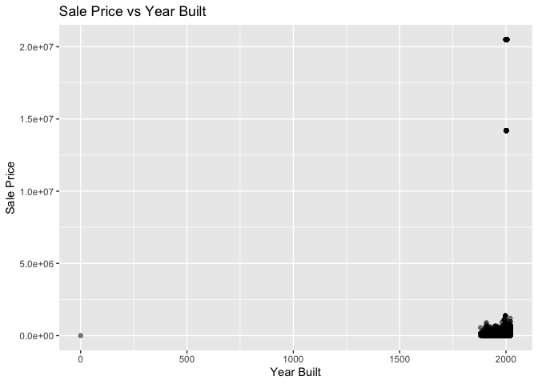<!-- -->

Does YearBuilt Describe any Oddities Discovered in 3?

``` r
ames %>%
  filter(`Sale Price` == 0) %>%
  select(`Sale Price`, YearBuilt, Address, `Multi Sale`, Occupancy, Neighborhood) %>%
  head(15)
```

    ## # A tibble: 15 × 6
    ##    `Sale Price` YearBuilt Address            `Multi Sale` Occupancy Neighborhood
    ##           <dbl>     <dbl> <chr>              <chr>        <fct>     <fct>       
    ##  1            0      1951 2030 MCCARTHY RD,… <NA>         Single-F… (32) Res: C…
    ##  2            0      1960 511 25TH ST, AMES  <NA>         Single-F… (27) Res: N…
    ##  3            0      1950 1311 CARROLL AVE … <NA>         Two-Fami… (27) Res: N…
    ##  4            0      1992 1417 INDIANA AVE,… <NA>         Townhouse (36) Res: S…
    ##  5            0      1995 2873 GREENSBORO C… <NA>         Townhouse (21) Res: V…
    ##  6            0      1966 1211 25TH ST, AMES <NA>         Single-F… (27) Res: N…
    ##  7            0      1997 4026 BERKSHIRE AV… <NA>         Single-F… (25) Res: G…
    ##  8            0      1975 1612 TRUMAN DR, A… <NA>         Single-F… (26) Res: N…
    ##  9            0      1972 1312 ONTARIO CIR … <NA>         Townhouse (49) Res: M…
    ## 10            0      1955 3521 ROSS RD, AMES <NA>         Single-F… (35) Res: S…
    ## 11            0      1968 632 20TH ST, AMES  <NA>         Single-F… (27) Res: N…
    ## 12            0      1891 726 DUFF AVE 724,… <NA>         Single-F… (29) Res: O…
    ## 13            0      1955 311 S 3RD ST, AMES <NA>         Single-F… (30) Res: I…
    ## 14            0      1996 2853 GREENSBORO C… <NA>         Townhouse (21) Res: V…
    ## 15            0      2013 5411 SPRINGBROOK … <NA>         Single-F… (37) Res: C…

For my individual investigation, I chose YearBuilt as a variable that
might be related to Sale Price. Based on the summary statistics,
YearBuilt ranges from 0 to 2022, with a median of 1978 and a mean of
1976. Most homes in the dataset seem to have been built between the
mid-1900s and early 2000s, since the first quartile is 1956 and the
third quartile is 2002. The histogram shows that a large portion of the
homes were built in more recent decades, especially from around the
1950s onward, while there are fewer very old homes. One thing that
stands out, though, is that the minimum value is 0, which is clearly not
a real construction year. That likely means some records are missing or
entered incorrectly, so YearBuilt = 0 should be treated as an odd value
rather than a real year.

To look at the relationship with the main variable, I made a scatterplot
of Sale Price versus YearBuilt. In general, there seems to be a slight
positive relationship, where newer homes tend to sell for more than
older homes. At the same time, the relationship is not super strong,
since there is still a lot of spread in sale prices across many
different build years. The plot also has a few extremely large sale
price outliers, which make most of the other points bunch together near
the bottom of the graph. Because of that, the overall trend is harder to
see clearly, but it still looks like newer homes are often associated
with higher prices.

I also checked whether YearBuilt helps explain the oddity from Step 3,
which was that some homes have Sale Price = 0. Looking at those rows,
the zero-price homes were built across a wide range of years, including
1950, 1951, 1955, 1960, 1966, 1972, 1975, 1992, 1995, and 1997. Since
those zero-price sales are not all concentrated in one time period,
YearBuilt does not seem to explain that oddity very well. In other
words, the homes with zero sale price are not all especially old or
especially new. That makes it more likely that the zero values are due
to something else, such as unusual transaction records or
missing/placeholder sale data.

Pablo Result:

``` r
ames_clean <- ames |>
  group_by(`Multi Sale`, `Sale Price`) |>
  mutate(
    units_in_sale = n(),
    adjusted_price = ifelse(
      !is.na(`Multi Sale`),
      `Sale Price` / units_in_sale,
      `Sale Price`
    )
  ) |>
  ungroup()


ames_clean <- ames_clean |>
  filter(
    !is.na(`TotalLivingArea (sf)`),
    !is.na(`Sale Price`),
  )

ames_clean <- ames_clean |>
  filter(
    adjusted_price > 50,
    `TotalLivingArea (sf)` > 0,  
  )

view(ames_clean)
```

On first glance, the dataset seemed to have many outliers with
extraordinarily high sale prices for the given property. On further
inspection, however, it was determined that entries in this dataset that
were bought as a package are still listed individually, only with the
Multi Sale flag set to ‘Y’. As a result, the package sales with many
properties being bought at once listed each property as having the sale
price of the entire package. This skews the median sale price higher and
makes data analysis and visualization difficult. To remedy this, I
mutated the dataset to append an adjusted_price variable that divides
the total sale price by the number of units sold to get an average
property sale price for each unit. This only affects entries with a non
null Multi Sale feature. Additionally, as part of the cleaning process,
I filtered out entries with null / nonzero TotalLivingArea or null Sale
Price and only saved entries with an adjusted_price of more than 50, to
avoid questionable outliers.

``` r
ggplot(data = ames_clean, aes(x = `TotalLivingArea (sf)`)) +
  geom_histogram(binwidth = 100)
```

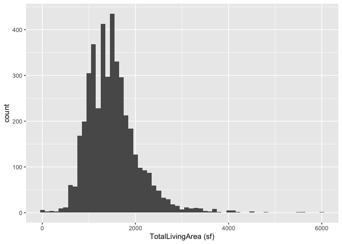<!-- --> The result
of the data cleaning is a satisfactory right skewed histogram that shows
most properties as having between 1000 and 2000 square feet of total
living area.

``` r
# priceHist <- filter(ames_clean, `adjusted_price` > 900)
ggplot(data = ames, aes(x = `Sale Price`)) +
  geom_histogram(binwidth = 10000)
```

<!-- -->

``` r
ggplot(data = ames_clean, aes(x = `adjusted_price`)) +
  geom_histogram(binwidth = 10000)
```

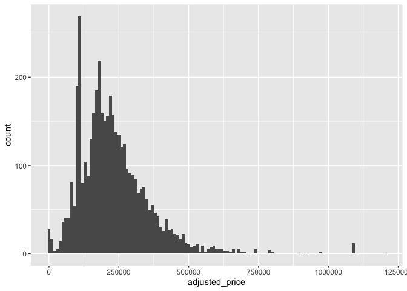<!-- -->

``` r
outlier <- ames_clean
  # filter(`adjusted_price` < 50000)
outlier |>
  select(Address, Style, `Sale Date`, `Sale Price`, `Multi Sale`, `adjusted_price`) |>
  arrange(`adjusted_price`) |>
  view()

multi_sales_collapsed <- ames_clean |>
  filter(`Multi Sale` == "Y") |>
  group_by(`Sale Date`, `Sale Price`) |>
  summarise(
    address_example = first(Address),
    units_in_sale = n(),
    average_price = first(adjusted_price),
    .groups = "drop"
  ) |>
  filter(units_in_sale > 1) |>
  arrange(desc(`units_in_sale`))
head(multi_sales_collapsed, 15)
```

    ## # A tibble: 8 × 5
    ##   `Sale Date` `Sale Price` address_example           units_in_sale average_price
    ##   <date>             <dbl> <chr>                             <int>         <dbl>
    ## 1 2022-05-26      20500000 416 BILLY SUNDAY RD UNIT…           188       109043.
    ## 2 2022-03-01      14200000 4912 MORTENSEN RD UNIT 1…           144        98611.
    ## 3 2022-04-01       1100000 908 DOUGLAS AVE UNIT 1, …            12        91667.
    ## 4 2022-07-18       1370000 3315 ROY KEY AVE UNIT 2,…            12       114167.
    ## 5 2022-01-01        909600 4524 STEINBECK ST UNIT 1…             8       113700 
    ## 6 2022-02-22        610000 216 S SHERMAN AVE, AMES               4       152500 
    ## 7 2022-03-31        465000 1425 STAFFORD AVE, AMES               3       155000 
    ## 8 2022-05-31        475000 103 WILMOTH AVE, AMES                 3       118750

The before and after histograms of the Sale Price also demonstrate the
effect of the data cleaning. The second histogram avoids the outlier
issues that the original dataset has, namely the huge amount of
properties with a sale price of 0 that throws off the scale of the
chart, and the two large package sales of \$14.2m and \$20.5m that has a
similar effect. The largest package sales can be seen in the dataframe
above. Note that the cleaned histogram sees large spikes in count at
\$109k and \$98k due to the two largest package sales that include 188
and 144 units in sale respectively.

``` r
ggplot(data = ames, aes(x = `TotalLivingArea (sf)`, y = `Sale Price`)) +
  geom_point() + 
  geom_smooth(method = "lm")
```

    ## `geom_smooth()` using formula = 'y ~ x'

    ## Warning: Removed 447 rows containing non-finite values (`stat_smooth()`).

    ## Warning: Removed 447 rows containing missing values (`geom_point()`).

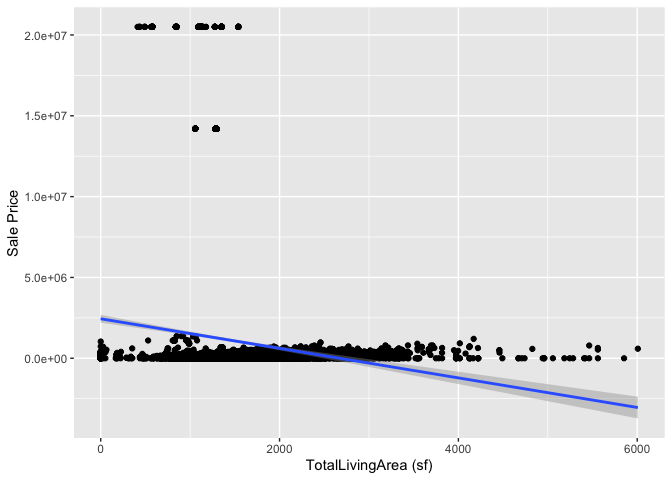<!-- -->

``` r
ggplot(data = ames_clean, aes(x = `TotalLivingArea (sf)`, y = `adjusted_price`)) +
  geom_point() + 
  geom_smooth(method = "lm")
```

    ## `geom_smooth()` using formula = 'y ~ x'

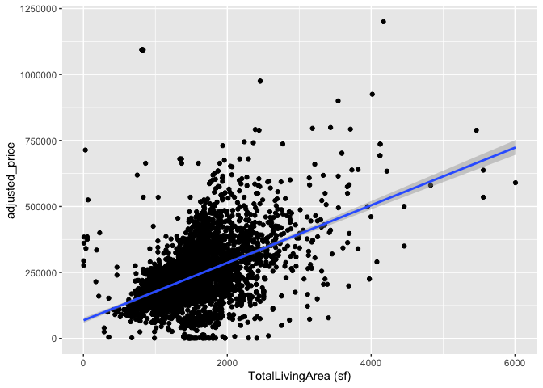<!-- -->

The end result is that we can observe a positive correlation between
TotalLivingArea and adjusted_price in the scatterplot with cleaned data,
as expected. As a property gets bigger, it’s price should increase as
it’s more desirable. The scatterplots using both the original dataset
and the cleaned dataset are provided as reference.

Follow the instructions posted at
<https://ds202-at-isu.github.io/labs.html> for the lab assignment. The
work is meant to be finished during the lab time, but you have time
until Monday evening to polish things.

Include your answers in this document (Rmd file). Make sure that it
knits properly (into the md file). Upload both the Rmd and the md file
to your repository.

All submissions to the github repo will be automatically uploaded for
grading once the due date is passed. Submit a link to your repository on
Canvas (only one submission per team) to signal to the instructors that
you are done with your submission.
